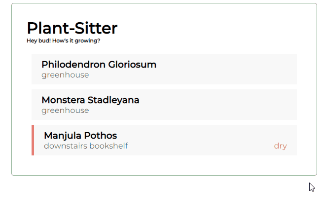
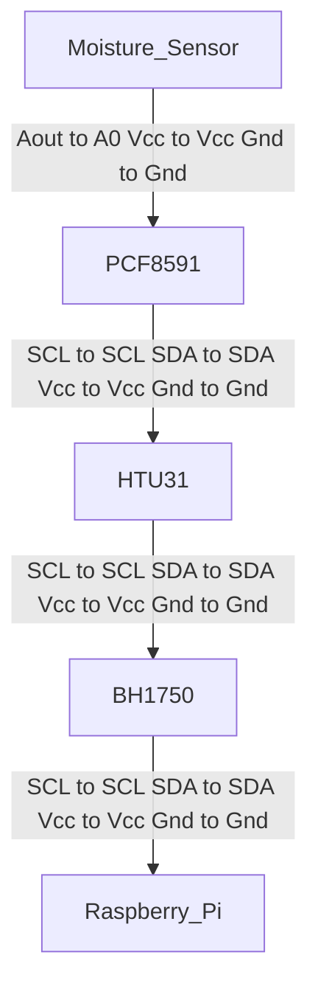

# Plant Monitor - Data Collection

This is an application that monitors the temperature, humidity, light intensity, and soil moisture conditions for your plants. The data can be easily viewed, allowing you to notice any patterns that may be helping or hindering your plants. 



# Setting up project

This is a full-stack web application that is broken up across a few different repositories - the [front-end,](https://github.com/Clara-ra/plant-sitter-client) the [back-end,](https://github.com/Clara-ra/plant-sitter-api) and the [data-collection.](https://github.com/Clara-ra/plant-sitter-api)

---
This repository is the **data-collection portion**. To grab the rest, see below.

The data collection is run on a Raspberry Pi with various sensors connected.

**Hardware used** 
- BH1750 Light Sensor
- HTU31 Temperature and Humidity Sensor
- Capacitive Moisture Sensor
- PCF8591 (For Analog to Digital Conversion. Not neccessary if all three sensors have digital output.)
- Raspberry Pi 4b with Python3 installed and connected to the internet.

**Software needed**
- Circuit Python( Setup [here](https://learn.adafruit.com/circuitpython-on-raspberrypi-linux/installing-circuitpython-on-raspberry-pi))
- BH1750 Module ( Repository [here](https://github.com/adafruit/Adafruit_CircuitPython_BH1750) )
- HTU21D Module ( Repository [here](https://github.com/adafruit/Adafruit_CircuitPython_HTU21D) )
- PCF8591 Module ( Respository [here](https://github.com/adafruit/Adafruit_CircuitPython_PCF8591) )

**Hardware Setup**

The  HTU31, BH1750, and PCF8591 sensors all use i2c communication. Thus, these can be connected to eachother. The Capasitive Moisture sensor connects to PCF8591, as it outputs the analog. I used the following setup :



**Software Setup**

Download the software listed above. Then the environment must be setup to ensure the client can access the server. Create a .env under the root folder - 

```
SERVER_URL=url_here
```
Once your environment file and hardware are setup, you are ready to begin collection.

To begin data collection, run the following -

`python main.py`

Follow the prompts that appear.

---
For the **front-end portion**, go [here.](https://github.com/Clara-ra/plant-sitter-client)

React must be setup to run the client. It uses an environment variable to define the server's URL. To adjust the this URL, edit the .env file in the root folder -

```
REACT_APP_API_URL = http://localhost:8000
```

By default, it is set to listen at port 8000, as the server starts running here by default. Change this as needed.

The client can be started by running the following -

`npm start`

However, the client alone is not enough. The back-end must be set up as well.

---
For the **back-end portion**, go [here.](https://github.com/Clara-ra/plant-sitter-api)

Node is neccessary to set up the back-end. Once cloned, make sure to install the neccessary packages -

`npm install`

Before the server can be run, an environment file needs to be set up. under config, create a ".env" file -

`touch config/.env`

This server relies on using MongoDB. In your environment file, store your connectionURI in the DB_STRING variable.
You can also set your port in this file. Keep in mind that your client needs to know what the server's URL is. I use port 8000, but you can set it to be whatever you want -

```
DB_STRING = connectionURI-here
PORT = 8000
```

To create the data used by the database, data collection needs to be set up as well.

---


## How It's Made:

**Tech used:** React, Node, Express, MongoDB, Javascript, Python, CSS

This is application is implemented using a MERN stack, as well as python for the data-collection.
The data-collection is performed using a raspberry pi with various i2c sensors connected. These sensors read the light, humidity, temperature, and moisture. Upon starting up the python client, it will send a request to the sever for the current list of plants registered in the database. This list is provided to the user so they can select the plant that is undergoing data-collection. The user can also register a new plant, or edit existing plants. These actions are sent as requests to the server. Once the user selects a plant, the plant ID for the plant is saved so it can be included in future data packets. The raspberry pi will begin to collect data. Every hour the raspberry pi will read the output of each sensor and send over these datapoints as post requests to the server.

The server utilizes Node and Express. It listens for any requests coming from the data collector as well as the React client. Using mongoose, the server defines two schemas - one for plants, and one for plant datapoints. It provides several endpoints, allowing clients to add new plants to the database, update them, and retrive their information. It can also add/retrieve datapoints for a specified plant ID. These items are retrieved from the database.

My instance of the database is hosted on MongoDB Atlas so that it can be accessed from anywhere. It has two collections - a plant collection, and a plantStatus collection. The plants contain the name of the plant, the location of the plant, and any potential issues the plant may be experiencing. The plantStatus collection is comprised of datapoints. Each datapoint contains a timestamp, lux reading, temperature, humidity, moisture reading, and a reference to the ID of the plant the data is associated with. 

The client is bootstapped with [React](https://github.com/facebook/create-react-app). It fetches the list of plants from the server and displays them. This list is kept as a state within the App component. When a plant is clicked, the selected plant is also stored within a state for easy reference later. The client sends a request for all datapoints associated with the plant, and the data is displayed using chart.js. The various fetches made to the server are kept in react hooks such as useEffect to ensure they are triggered at the right time (e.g. initial page load).

## Optimizations

In the future I would like to implement a more graceful shutdown procedure for the server. Currently, there  is none. Upon getting a kill signal, I'd like my server to stop receiving requests, handle the any requests that managed to slip through, and shutdown.  
I'd also like to implement more robust error handling. The server should have custom errors to handle operational errors such as failing to connect to the databade, invalid user input, and timeouts. When a programming error occurs, the server should be gracefully restarted so that it can continue to recieve requests.
The data-collector should also be more robust to outlier readings. Instead of just using the first datapoint that is read from the sensor, I should take 5 readings within a short span, and compare them. These values should be more or less equivalent, otherwise that could indicate a sensor issue that I would like to flag for future viewing. This would also allow me to throw away any invalid datapoints. 
On the client side, instead of displaying graphs I would like to display the most recently read values. Then if the user would like, they can see the graphs. The timeframe for the graphs should be adjustable as well.
